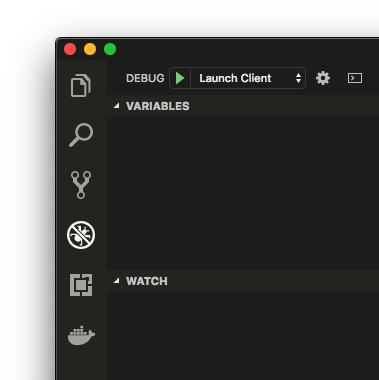

# TEASPN SDK

## Overview

This is the SDK (Software Development Kit) of [TEASPN](https://www.teaspn.org/), a framework and a protocol for integrated writing assistance environments. Specifically, this repository includes:

* [client](client/) - sample TEASPN client implementation for Visual Studio Code
* [server](server/) - TEASPN server library and sample implementation in Python

For the details of TEASPN, see [the official website](https://www.teaspn.org/).

## Prerequisites

* Visual Studio Code 1.26.0+
* Python 3.7+
* node and npm

## Install

First, clone the repository, and at the project root, run:

```shell
  $ npm install
```

Then, run the following in order to install Python dependencies:

```shell
  $ python3 -m venv .pyenv
  $ source .pyenv/bin/activate
  $ pip install -r requirements.txt
```

## Getting started

In order to run the sample TEASPN client, open the repository directory using Visual Studio Code, and then run "Launch Client" from the debug menu:



For more details on the client code, see [client/src/extension.ts](client/src/extension.ts).

For more details on the server code, see the [server/](server/) directory. In order to implement your own TEASPN server, you need to inherit `TeaspnHandler` defined in [server/teaspn_handler.py](server/teaspn_handler.py) and override some methods. See [server/handler_impl_sample.py](server/handler_impl_sample.py) for a sample implementation.

## License

Copyright (c) TEASPN developers. All rights reserved.

Licensed under [the MIT License](LICENSE.txt).
